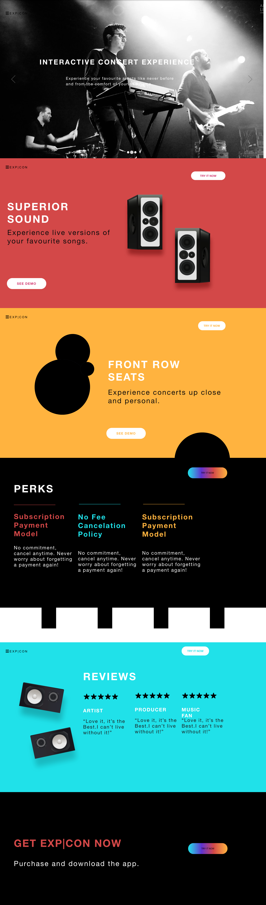
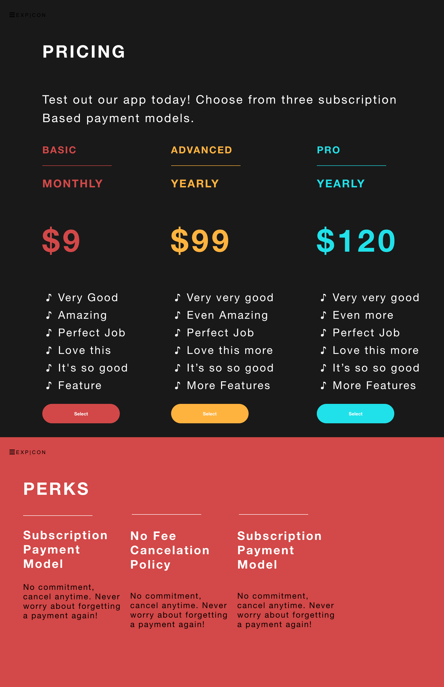
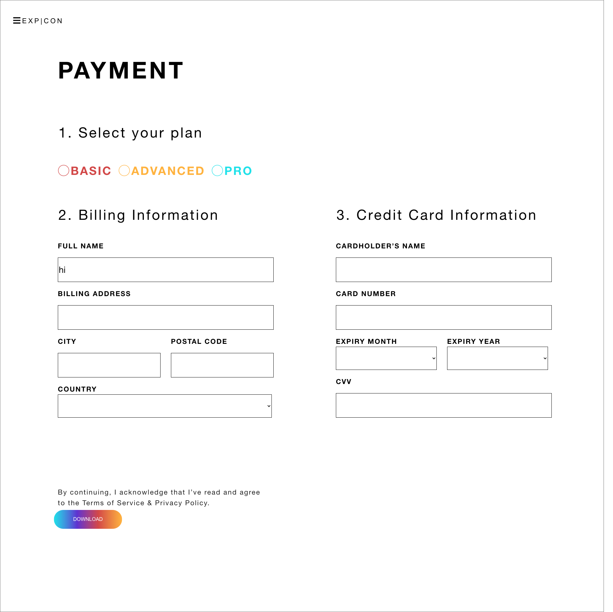
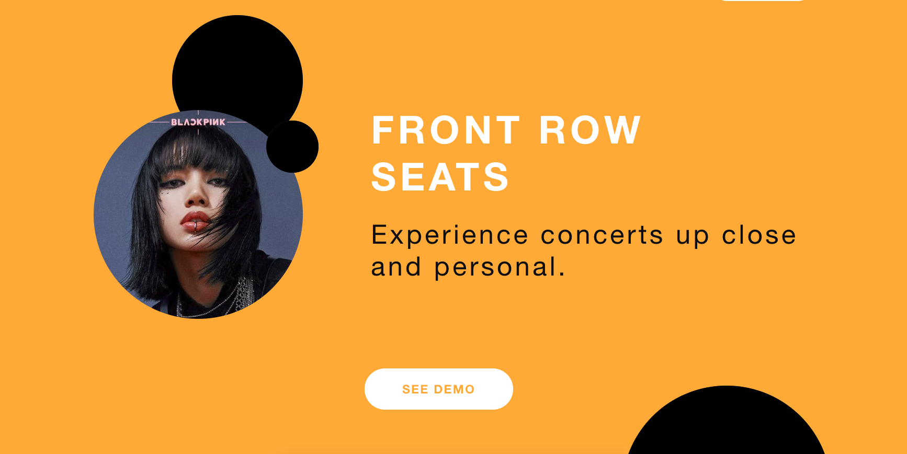
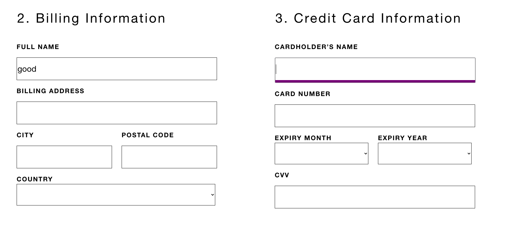
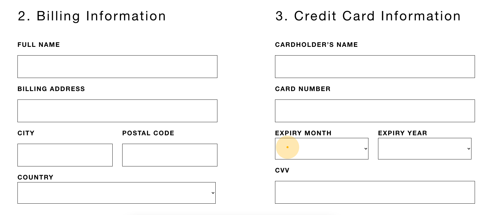

# FRONT-END PROJECT #
- ReactJS is used to build this front end project 

## Installation:
      git clone https://github.com/ginguan/exp.git
      npm install
      npm start

## Screen: Landing Main Landing Page
### Hero Section
- Three image slider
  - The slides should change automatically after about 10 seconds or when the small white buttons are pressed.
- Liquid Gradient CTA button
  - Example: https://codepen.io/fixcl/pen/CsndK
  - This button should take you to the pricing screen.
- Menu animation:
  - Clicking on the hamburger menu should expand it 

### Section 2: RED
<!--Switch to an interactive cursor like on this site: https://fleava.com/
When you click the speakers it should start playing music (we recommend using the Web Audio API for this: https://developer.mozilla.org/en-US/docs/Web/API/Web_Audio_API)
Click again to turn the music off-->
- White CTA Buttons should have a hover effect similar to this: https://codepen.io/nguyencaotai1969/pen/oNNJdJr
- The ‘Try it now’ button should take you to the pricing screen
- The ‘see demo’ button doesn’t link to anything

### Section 3: YELLOW

- When you hover over different areas of the page, more of the background image should reveal itself
- If you hover over the text, the text should invert in colour while the image is behind it
- The ‘Try it now’ button should take you to the pricing screen

### Section 4: Perks

- The ‘Try it now’ button should take you to the pricing screen
- This button has the same animation as the hero section CTA.

### Section 5: Reviews

- White CTA Buttons should have a hover effect
- The ‘Try it now’ button should take you to the pricing screen

### Section 6: Get EXP|CON now

- The ‘Try it now’ button should take you to the pricing screen
- This button has the same animation as the hero section CTA.

## Screen: Pricing

- The select buttons should take you to the payments screen
- Button animation should be the same as the white buttons on the other pages
- cursor animation

## Screen: Payments

- While typing in the boxes, a purple highlight should appear when the type box is clicked
- The ‘download’ button should have the same animation as the hero section CTA.
- If the boxes are empty, the ‘download’ button should be disabled

## Some screenshots of the project (in progress)##
### 3 Pages ###

  

  

